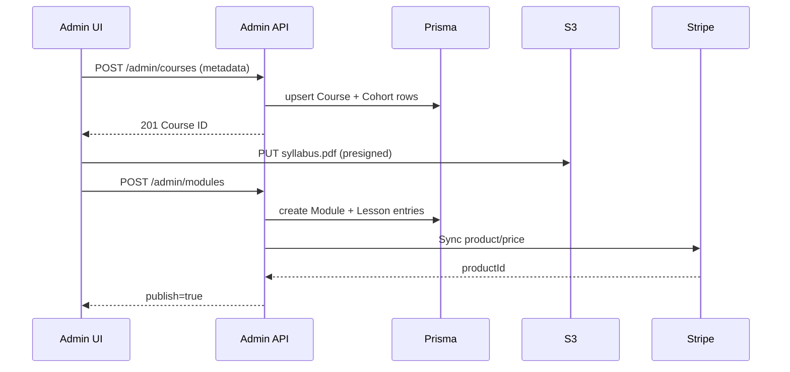

# Virgo Platform System Architecture

## High-Level View

```mermaid
graph TD
  subgraph Clients
    A1[Marketing Web (Next.js)]
    A2[Student Dashboard]
    A3[Admin Panel]
  end

  subgraph Services
    B1[NestJS API]
    B2[Payments Proxy]
    B3[Background Workers]
  end

  subgraph Data
    C1[(Postgres)]
    C2[(Redis Cache)]
    C3[(S3 Media Bucket)]
  end

  subgraph Integrations
    D1[Stripe]
    D2[YooKassa]
    D3[Vimeo/S3 Video CDN]
    D4[Search Console]
  end

  A1 -->|SSR/ISR| B1
  A2 -->|Auth JWT| B1
  A3 -->|Admin Session| B1
  B1 -->|ORM| C1
  B1 -->|Cache| C2
  B1 -->|Media URLs| C3
  B2 --> D1
  B2 --> D2
  B3 -->|Webhooks| B2
  D1 -->|Webhook| B2 --> B1
  D2 -->|Webhook| B2 --> B1
  B1 -->|Events| B3
  B1 --> D4
```

## Request Lifecycle

1. Client hits the appropriate Next.js app (web/student/admin).
2. Middleware validates locale and admin roles; Next.js server components fetch data through `apps/admin/src/lib/api.ts`.
3. NestJS API authenticates via Supabase JWT (students) or Admin session token.
4. Prisma reads/writes Postgres; frequently used lookups (course catalog, progress summaries) are cached in Redis for 2–5 minutes.
5. Media assets (syllabus PDFs, lesson thumbnails, brand kit) are stored on S3 with presigned upload URLs for admin forms.
6. Payments go through the Payments Proxy, which normalizes Stripe/YooKassa payloads and stores the normalized `orders` + `payments` rows.
7. Background workers (BullMQ) fan out long-running tasks: certificate rendering, sending onboarding emails, syncing Search Console sitemaps.

## Deployment Topology

- **Web/Admin** – Next.js apps deployed via Vercel. Preview environments per PR reuse the same shared API/DB but with isolated auth tenants.
- **API** – NestJS service running in AWS ECS Fargate (2 replicas minimum). Autoscaling triggered by p95 latency > 200ms.
- **Database** – AWS RDS Postgres 15 with daily snapshots + PITR.
- **Cache** – Elasticache Redis with multi-AZ failover.
- **Object storage** – S3 standard class, versioning enabled.
- **Observability** – Datadog agents collect logs/metrics/traces; Grafana dashboards display course enrollment, failed payments, and queue depth.

## Sequence: Admin publishes course



## Access Control Matrix

| Role | Admin Panel | Payments | Content Publishing |
|------|-------------|----------|--------------------|
| Admin | Full access | Refund / payouts | Approve + publish |
| Manager | CRUD courses/modules | View | Request approval |
| Support | Read-only | Issue manual invoices | No |

Roles are enforced by `ensureAdmin` middleware (frontend) and NestJS guards (backend). The guard injects `AdminRole` claims into the request context so each resolver can allow/deny granular actions.
